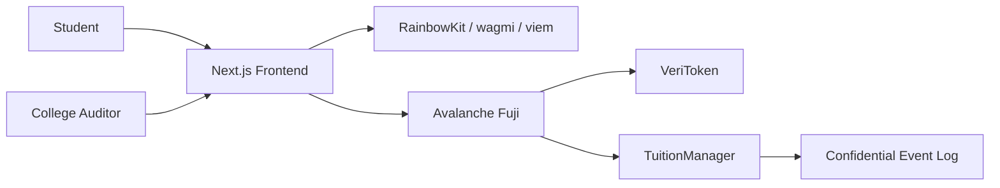
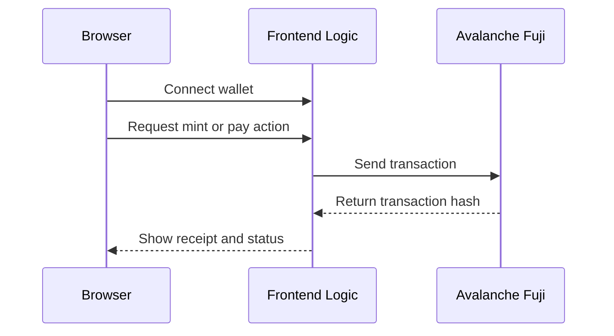
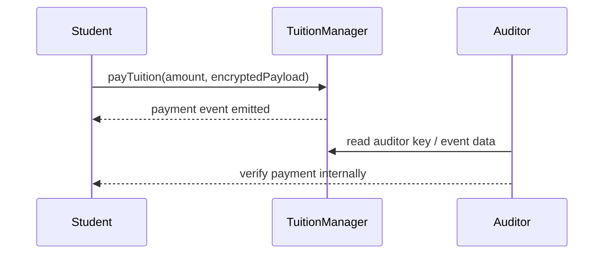

# VeriTuition Architecture

## System Overview

VeriTuition separates the experience into four layers:

1. Frontend dashboard for students and auditors
2. Wallet integration for signing and sending transactions
3. Smart contracts for tuition payment and receipt logging
4. Privacy layer for encrypted amounts and controlled verification

## Architecture Diagram

## API Flow

## Smart Contract Flow

## Privacy Design

The MVP uses an encrypted payload approach so the important tuition details are not shown in the public interface. A stronger version can move to eERC for encrypted value handling and a Private L1 for private execution.

## Deployment Targets

- Local frontend: http://localhost:3000
- Avalanche Fuji testnet for contract deployment
- GitHub repository for hackathon submission
